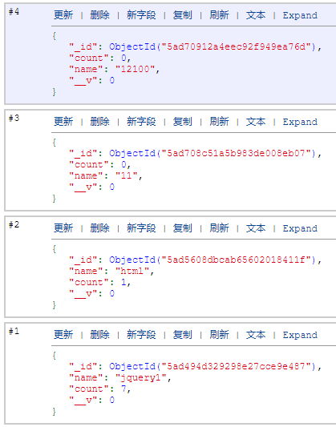
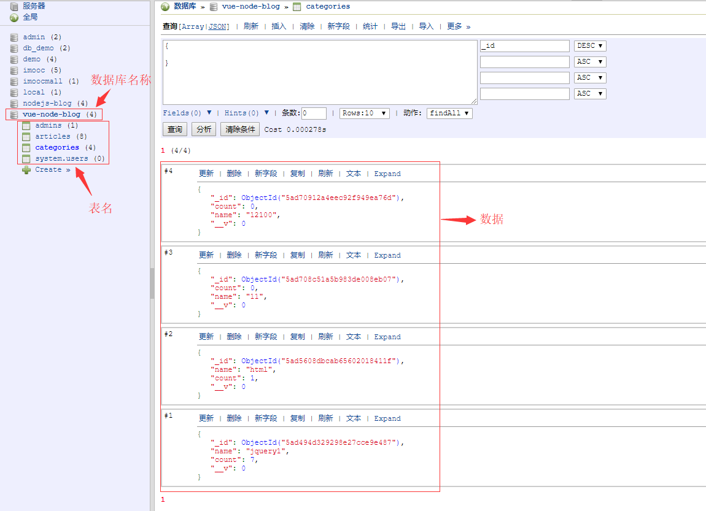
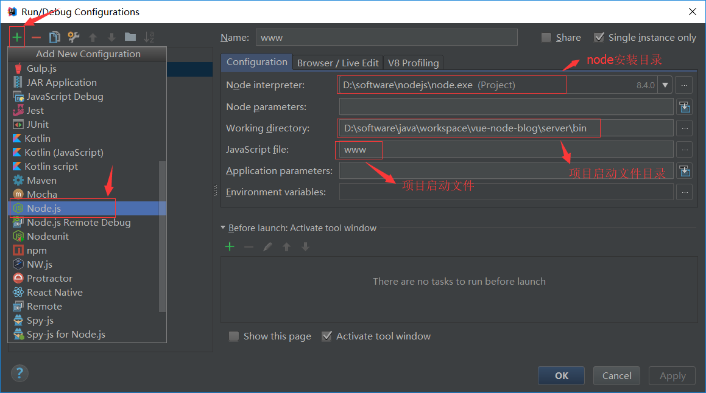

# 基于vue2.X + Nodejs + mongoDB实现分类的增删改查
    项目采用的技术有：Vue2.X + Nodejs（express） + mongoDB + bootsrtap + Sass + webpack 搭建个人博客
                   文章采用markdown
                   
    项目线上地址：http://vueblog.myoli.xin/ 帐号1 密码2（管理员登录在最底部）

## 1 项目结构介绍 
### 1.1 目录结构
       |- build
         |- build.js
         |- check-versions.js
         |- utils.js
         |- vue-loader.conf.js
         |- webpack.base.conf.js
         |- webpack.dev.conf.js 
         |- webpack.prod.conf.js
       |- config 配置文件
         |- dev.env.js
         |- index.js nodejs端口的配置、数据的访问地址
         |- prod.env.js
       |- dist 编译后的环境
       |- server nodejs环境（重点）
         |- bin
         |- models 模型 用于对表结构的操作
         |- public 公用文件（css）
         |- routes nodejs路由（服务端的路由）
         |- schemas 表结构
         |- util 小工具：日期格式
         |- views nodejs静态页面（废弃，因为采用vue的框架）
         |- app.js nodejs入口配置文件
       |- src vue主要开发环境（重点）
         |- assets 静态资源（偏组件资源、图片会被打包成base64）
           |- 图片
         |- components 组件
         |- router 配置路由（前端的路由）
         |- views vue页面
         |- main.js 入口文件
       |- static 静态资源（图片不会被压缩、放图片比较大的）

### 1.2 安装的依赖
     node依赖：
       npm install serve-favicon --save
       npm install morgan --save
       npm install cookie-parser --save
       npm install body-parser --save
       npm install cookie-parser --save
       npm install express --save
       npm install ejs --save
       npm install debug --save
       npm install jade --save
       npm install markdown --save
       
       
     Vue依赖：
       npm install axios --save
       
       // 使用sass（sass-loader依赖于node-sass）
       npm install style-loader --save
       npm install css-loader --save
       npm install sass-loader --save
       npm install node-sass --save
       
       // bootstrap
       npm install jquery --save
       npm install bootstrap@3.3.7 --save
       
       
     mongoose依赖:
       npm install mongoose --save
  
  
     markdown依赖:
       npm install marked --save
       // 同步滚动
       npm install vue-scroll --save

### 1.3 项目启动
     1、运行vue：npm run dev
        生成上线目录（部署）：npm run build（生成dist目录）
     2、启动mongodb
     3、运行nodejs：直接右上角启动

## 2 技术介绍
### 2.1 mongoDB
    官方文档：http://mongoosejs.com

#### 2.1.1 mongoDB简介
> MongoDB 是由C++语言编写的，是一个基于分布式文件存储的开源数据库系统。

> 在高负载的情况下，添加更多的节点，可以保证服务器性能。

> MongoDB 旨在为WEB应用提供可扩展的高性能数据存储解决方案。

> MongoDB 将数据存储为一个文档，数据结构由键值(key=>value)对组成。MongoDB 文档类似于 JSON 对象。字段值可以包含其他文档，数组及文档数组。

#### 2.1.2 mongoDB安装教程
[安装教程](http://www.runoob.com/mongodb/mongodb-window-install.html)

#### 2.1.3 创建简单的bat执行文件
> 把下面的代码，保存成后缀.bat的文件（以后不用一直敲重复的代码，双击便可运行）

    d:
    cd software\MongoDB\bin
    mongod --config c:\MongoDB\etc\mongo.conf --port=27017

#### 2.1.4 基本命令
> 进入mongo：mongo

> 查看有哪些数据库：show dbs

> 查看数据库下的所有表名：show tables

> 创建数据库：use db_demo（创建了不能马上在可视窗口里面看到，表里面要有数据才可以看到）

> 创建表集合：db.createCollection("db_demo")（同上，可以马上看到）

> 删除指定的表：db.db_demo.drop()

> 往数据库里插入数据：db.categories.insert({"count":"0","name":"hjy"})

> 修改数据(把name为hjy的count改为100)：db.categories.update({name:'hjy'},{$set:{count:100}})

> 删除数据：db.categories.remove({"name":"hjy"})

> 查看指定表里所有内容：db.categories.find()

> 查询查看指定表里一条内容（并且会对数据进行格式化）：db.categories.findOne()

#### 2.1.5 图形界面软件
    RockMongo

### 2.2 vue核心知识
#### 2.2.1 axios请求接口
    Axios中文说明：https://www.kancloud.cn/yunye/axios/234845

    安装：npm install axios --save 
    
    POST请求：
    axios.post('url', {
      // 参数
      key: value
    }).then((response) => {
      // 请求到的内容
    })
    
    GET请求：
    axios.get('url').then((response) => {
      // 请求到的内容
    })
    
#### 2.2.2 路由跳转
    // 动态设置vue路由跳转
    
    this.$router.push({
      // path代表要跳转的路由
      path: 'url',
      // query里传入键值对，代表要在地址栏上显示的信息
      query: {key: value}
    })
    
#### 2.2.3 监听路由变化
    watch: {
      /**
       * 路由发生改变
       * to：当前路由
       * from：上一个页面的路由
       */
      '$route' (to, from) {
        if (to !== from) {
          // 进行对应的操作
        }
      }
    }
    
### 2.3 nodejs核心知识
#### 2.3.1 express-generator express生成器
> 功能：自动生成node环境（也就是server下的目录文件，实现基本的环境搭建）
    
    查看版本：express --version
    生成express项目：express server
    启动node：cd server
             node bin/www
    
#### 2.3.2 快速启动node

#### 2.3.3 node接口文档
##### 2.3.3.1 获取所有分类(/admin/categoryList)
    Method:GET
    
    请求内容：无
    
    返回值说明：
      status：0 请求成功
      status：1 请求错误
      
      list: _id  : 分类id  
            count: 分类下的文章总数
            name : 分类名称
    
##### 2.3.3.2 添加分类(/admin/categoryAdd)
    Method:POST
    
    请求内容：
      name：分类名称
      
    返回值说明：
      status：0 请求成功
      status：1 请求错误
      status：2 分类已经存在
      status：3 分类名称不能为空
    
##### 2.3.3.3 删除分类(/admin/categoryDel)
    Method:POST
    
    请求内容：
      categoryId：分类id
      
    返回值说明：
      status：0 请求成功
      status：1 请求错误
      status：2 该分类下有文章，不能删除
      status：3 分类id不能为空
    
##### 2.3.3.4 获取要修改分类名称(/admin/categoryFindOne)
    Method:POST
    
    请求内容：
      categoryId：分类id
      
    返回值说明：
      status：0 请求成功
      status：1 请求错误
      status：2 分类id不能为空
    
      _id  : 分类id  
      count: 分类下的文章总数
      name : 分类名称
    
##### 2.3.3.5 修改分类 -- 保存(/admin/categoryEdit)
    Method:POST
    
    请求内容：
      categoryId：分类id
      categoryName：分类名称
      
    返回值说明：
      status：0 请求成功
      status：1 请求错误
      status：2 分类信息不存在
      status：3 用户没有修改
      status：4 数据库中已经存在同名的分类
      status：5 分类名称不能为空

### 2.3.3 node连接mongoDB
    var mongoose = require('mongoose');
    mongoose.connect('mongodb://127.0.0.1:27017/vue-node-blog');
    
    // 连接成功
    mongoose.connection.on('connected', function () { });
    
    // 连接失败
    mongoose.connection.on('error', function () { });
    
    // 断开连接
    mongoose.connection.on('disconnected', function () { });
    
### 2.3.4 node操作数据库基本用法
#### 2.3.4.2 添加 
      new Category({
        // 添加的内容
        key: value
      }).save(function (err2, doc2) {
        // 操作
      })
      
#### 2.3.4.3 删除
    Category.remove({
      // 删除的条件
      key: value
    }, function (err2) {
      // 操作
    })

#### 2.3.4.4 修改

    Category.update({
      // 要修改的id
      _id: value,
    }, {
      // 修改的内容
      name: categoryName
    }, function (err, doc) {
      // 操作
    })
    
#### 2.3.4.1 查询
    Category.find().sort({
        // 查询条件
        key: value
      }).exec(function (err, doc) {
        // 操作
      });
   
              
## THEN END 
## 后续推出项目部署教程
